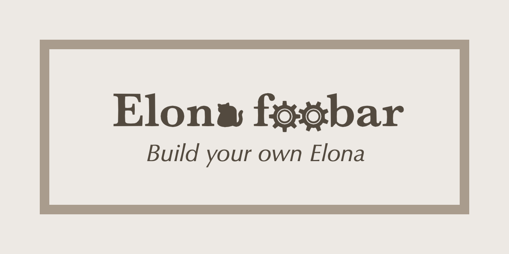

[](https://elonafoobar.com)


[](https://github.com/elonafoobar/elonafoobar/releases/latest)
[](LICENSE.txt)
[](https://ci.appveyor.com/project/ki-foobar/elonafoobar/branch/develop)
[](https://travis-ci.com/elonafoobar/elonafoobar)
[](https://github.com/elonafoobar/elonafoobar/actions)
[](https://twitter.com/ElonaFoobar)
[](https://discord.gg/4htdyc2)


# &lt;Elona foobar&gt;

* One of the Elona variants.
* It is made of C++.
* It is derived from Elona v1.22.
* It is still in an early stage of development.
* It features high extensibility through a mod system. [####+]
* It can be localized in multiple languages. [####+]
* It works on Windows, Linux and macOS. [####+]

> An Elona variant that has a mod system. With its high extensibility, you can build your own Elona.
>
> \~Ylva Fantasy Encyclopedia\~


# How To Build

## Requirements

* `make`
* CMake 3.2 or later
* C++ compiler which supports C++17
* Boost 1.69
* Lua 5.3
* SDL2, SDL2_image, SDL2_ttf and SDL2_mixer
* OpenSSL 1.1.x
* `clang-format`, `find` and `xargs` (Optional)

### Additional requirements for Windows

* Visual Studio 2017 x64

### Additional requirements for Linux

* SMPEG
* Timidity++


## Steps

1. Extract `elona122.zip` (from [here](http://ylvania.style.coocan.jp/file/elona122.zip)) to the `deps` directory, so `deps\elona` exists. This will allow for automatically copying the required assets.
2. Follow the platform-specific instructions below.

### macOS

1. Install the required dependencies.
```
brew install cmake boost sdl2 sdl2_ttf sdl2_mixer sdl2_image lua
```
2. `cd path/to/Elona_foobar; make build`


### Linux

1. Install the required dependencies. For Arch Linux:
```
sudo pacman -S cmake sdl2 sdl2_ttf sdl2_image sdl2_mixer gtk3 smpeg lua boost timidity++
```
For systems with `apt`:
```
sudo apt-get install cmake liblua5.3-dev libboost-all-dev libsdl2-dev libsdl2-image-dev libsdl2-mixer-dev libsdl2-ttf-dev gtk+-3.0 smpeg timidity
```
2. `cd path/to/Elona_foobar; make build`


### Windows

1. Download and install the binaries for Boost `1.69` from [here](https://dl.bintray.com/boostorg/release/1.69.0/binaries/boost_1_69_0-msvc-14.1-64.exe).
2. Edit `Makefile.win` to point to your Boost install directory.
3. Run `install.bat` inside the `deps` folder to move the other dependencies to `deps\include` and `deps\lib`.
4. Open the `Developer Command Prompt for VS 2017`.
5. `cd path/to/Elona_foobar & nmake build -f Makefile.win`

To debug with Visual Studio, open `bin\Elona_foobar.sln`.


### Note for parallel build

There are mainly 2 ways to build Elona foobar in parallel.

* [Ninja-build](https://ninja-build.org/) supports parallel build by default. CMake can generate build rule for ninja like this: `make CMAKE_ARGS="-GNinja" <BUILD TARGET>`
* `CMAKE_BUILD_PARALLEL_LEVEL` also works like this: `CMAKE_BUILD_PARALLEL_LEVEL=8 make <BUILD TARGET>`


# How To Play

1. Copy the `graphic` and `sound` folders from vanilla v1.22 to the directory containing the executable. Make sure not to overwrite any files that already exist, as they have been updated in this version.
2. Execute `bin/Elona_foobar`, `bin/Elona_foobar.app` or `bin/Debug/Elona_foobar.exe`.


# How To Contribute

See [CONTRIBUTING.md](.github/CONTRIBUTING.md) for details.


# License

MIT License. See [LICENSE.txt](LICENSE.txt) for details. This license is applied for the
contents in this repository. Note that images, sounds and fonts are not included.
For files under [runtime/graphic](runtime/graphic/) folder of the repository, see
[runtime/graphic/LICENSE.txt](runtime/graphic/LICENSE.txt).


## Thirdparty libraries

* [Catch2](https://github.com/catchorg/Catch2): see [license file](src/thirdparty/catch2/LICENSE).
* [hayai](https://github.com/nickbruun/hayai): see [license file](src/thirdparty/hayai/LICENSE).
* [sol2](https://github.com/ThePhD/sol2): see [license file](src/thirdparty/sol2/LICENSE.txt).
* [ordered_map](https://github.com/Tessil/ordered-map): see [license file](src/thirdparty/ordered_map/LICENSE).
* [boostrandom](https://github.com/boostorg/random): see [license file](src/thirdparty/LICENSE_1_0.txt).
* [cmake/FindXXX.cmake](https://github.com/tcbrindle/sdl2-cmake-scripts): see [license file](cmake/LICENSE).
* [nativefiledialog](https://github.com/mlabbe/nativefiledialog): see [license file](src/thirdparty/nfd/LICENSE).
* [cpp-netlib/uri](https://github.com/cpp-netlib/uri): see [license file](src/thirdparty/uri/LICENSE_1_0.txt).
* [xxHash](https://github.com/Cyan4973/xxHash): see [license file](src/thirdparty/xxHash/LICENSE).
* [zstr](https://github.com/mateidavid/zstr): see [license file](src/thirdparty/zstr/LICENSE).
* [minizip](https://github.com/mnoinvaz/minizip): see [license file](src/thirdparty/minizip/LICENSE).
* [json5](https://github.com/ki-foobar/json5): see [license file](src/thirdparty/json5/LICENSE).
* [inspect.lua](https://github.com/kikito/inspect.lua): see [license file](runtime/data/script/prelude/inspect.lua).
